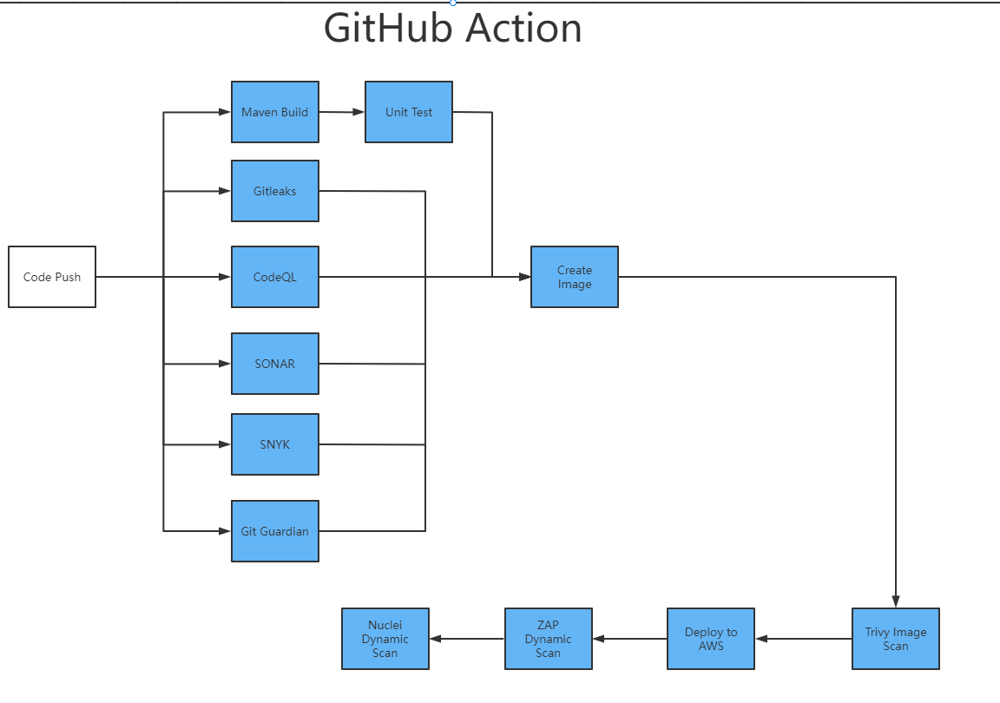

Secure CI/CD pipeline with GitHub Actions
=================

Secure CI/CD pipeline is a GitHub Action pipeline with security features for your projects. It uses varieties of security tools to eliminate vulnerabilities happens in the development process, bringing developers a clear view of the quality of the project.

This repo uses [MyBatis JPetStore](https://github.com/mybatis/jpetstore-6) project as a Java demo. 

The pipeline supports multiple programming languages. Here are the [Python demo](https://github.com/dky815/PythonDemo) and the [C# demo](https://github.com/dky815/CSharpDemo).

Structure
----------

## Modules
>
>
> | Name        | Description |
  > | -------------- | ----------- |
> | Gitleaks    | Gitleaks is a SAST tool for detecting and preventing hardcoded secrets like passwords, api keys, and tokens in git repos.                                                                                                                |
> | GitGuardian    | GitGuardian is a secret scanning tool for scanning your source code to detect api keys, passwords, certificates, encryption keys and other sensitive data in real-time.                                                                  |
> | CodeQL           | Discover vulnerabilities across a codebase with CodeQL, our industry-leading semantic code analysis engine.                                                                                                                              |
> | Semgrep          | A fast, open-source, static analysis engine for finding bugs, detecting vulnerabilities in third-party dependencies, and enforcing code standards.                                                                                       |
> | Sonar     | Enable your team to deliver clean code consistently and efficiently with a tool that easily integrates into the cloud DevOps platforms and extend your CI/CD workflow.                                                                   |
> | Snyk     | Find and automatically fix vulnerabilities in your code, open source dependencies, containers, and infrastructure as code.                                                                                                               |
> | Create Image   | Create a docker image containing the project                                                                                                                                                                                             |
> | Trivy   | Trivy (tri pronounced like trigger, vy pronounced like envy) is a comprehensive security scanner.                                                                                                                                        |
> | Deploy| Upload the image to the container registry, and deploy it to the specified cloud platform (Azure, AWS, or Google Cloud).                                                                                                                                                                                            |
> | ZAP | Web app vulnerbility                                                                                                                                                                                                                     |
> | Nuclei       | Nuclei is used to send requests across targets based on a template, leading to zero false positives and providing fast scanning on a large number of hosts.                                                                              |
> | FOSSA       | A software composition analysis tool that helps companies manage and track the open-source software components used in their codebase, providing insights into licensing compliance, security vulnerabilities, and dependencies.         |
> | Renovate       | A module that integrates automated testing and continuous integration workflows early in the development process using Github Actions, in order to catch issues earlier and improve the overall quality of the software being developed. |
> | Shift-Left       | Nuclei is used to send requests across targets based on a template, leading to zero false positives and providing fast scanning on a large number of hosts.                                                                              |
> | TruffleHog       | Scans repositories for sensitive data leaks and vulnerabilities using TruffleHog tool integrated with Github Actions.     

## How to Use

### Config

#### SONAR
- secrets.SONAR_TOKEN  
- Dsonar.projectKey

#### Gitleaks

#### GitGuardian
- secrets.GITGUARDIAN_API_KEY

#### Semgrep

#### CodeQL

#### snykScan
- secrets.SNYK_TOKEN

#### deploy
- secrets.AWS_ACCESS_KEY_ID
- secrets.AWS_SECRET_ACCESS_KEY
- env.AWS_REGION
- env.ECS_SERVICE
- env.ECS_CLUSTER
- env.ECS_TASK_DEFINITION //aws/task_definition.json
- evn.CONTAINER_NAME

### File
 - AWS Definition for deployment  
   https://docs.aws.amazon.com/AmazonECS/latest/developerguide/task_definitions.html  
   https://github.com/cl456852/jpetstore-6/blob/master/aws/task_definition.json
 - Docker File for creating docker image  
   https://github.com/cl456852/jpetstore-6/blob/master/Dockerfile

## License
[MIT](https://choosealicense.com/licenses/mit/)
